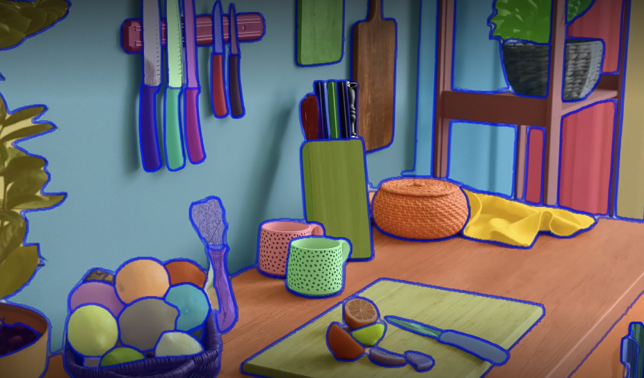

# Introduction



Computer vision is having its ChatGPT moment with the release of the Segment Anything Model (SAM) by Meta last week. Trained over 11 billion segmentation masks, SAM is a foundation model for predictive AI use cases rather than generative AI. While it has shown an incredible amount of flexibility in its ability to segment over wide-ranging image modalities and problem spaces, it was released without “fine-tuning” functionality.

<details> <summary>What is the Segment Anything Model (SAM)?</summary>
The Segment Anything Model (SAM) is a segmentation model developed by Meta AI. It is considered the first foundational model for Computer Vision. SAM was trained on a huge corpus of data containing millions of images and billions of masks, making it extremely powerful. As its name suggests, SAM is able to produce accurate segmentation masks for a wide variety of images. SAM’s design allows it to take human prompts into account, making it particularly powerful for Human In The Loop annotation. These prompts can be multi-modal: they can be points on the area to be segmented, a bounding box around the object to be segmented or a text prompt about what should be segmented.
</details>

<details> <summary>What is Model Fine-Tuning?</summary>
Publicly available state of the art models have a custom architecture and are typically supplied with pre-trained model weights. If these architectures were supplied without weights then the models would need to be trained from scratch by the users, who would need to use massive datasets to obtain state of the art performance.

Model fine tuning is the process of taking a pre-trained model (architecture+weights) and showing it data for a particular use case. This will typically be data that the model hasn’t seen before, or that is underrepresented in its original training dataset.

The difference between fine tuning the model and starting from scratch is the starting value of the weights and biases. If we were training from scratch, these would be randomly initialised according to some strategy. In such a starting configuration, the model would ‘know nothing’ of the task at hand and perform poorly. By using pre existing weights and biases as a starting point we can ‘fine tune’ the weights and biases so that our model works better on our custom dataset. For example: the information learnt to recognise cats (edge detection, counting paws) will be useful for recognising dogs.
</details>

<details> <summary>Why Would I Fine-Tune a Model?</summary>
The purpose of fine tuning a model is to obtain higher performance on data which the pre-trained model has not seen before. For example, an image segmentation model trained on a broad corpus of data gathered from phone cameras will have mostly seen images from a horizontal perspective.

If we tried to use this model for satellite imagery taken from a vertical perspective, it may not perform as well. If we were trying to segment rooftops, the model may not yield the best results. The pre-training is useful because the model will have learnt how to segment objects in general, so we want to take advantage of this starting point to build a model which can accurately segment rooftops. Furthermore, it is likely that our custom dataset would not have millions of examples, so we want to fine tune instead of training the model from scratch.

Fine tuning is desirable so that we can obtain better performance on our specific use case, without having to incur the computational cost of training a model from scratch.
</details>

<details> <summary>What is Low-Rank Adaptation (LoRA)?</summary>
LoRA is an adapter that is using 2 matrices B and A. The 2 matrices have specific dimensions (input_size, r) and (r, input_size) . By specifying a rank r < input_size, we reduce the parameters size and try to capture the task with a small enough rank. The matrix product B*A gives a matrix of shape (input_size, input_size) so no information is lost but the model will have learned a new representation through training.

For any application, we only need to initialize the matrices, freeze SAM and train the adapter so that the frozen model + LoRA learns to segment anythings that you need.
</details>

## Setup
The project use python poetry.

```bash
pip install poetry
```

If you are running this on a headless server, run this first so that poetry doesn't hang:
```bash
export PYTHON_KEYRING_BACKEND=keyring.backends.fail.Keyring
```

To install the dependencies use:
```bash
poetry config virtualenvs.in-project false
```

```bash
poetry install --all-extras
```

Some dependencies are not loaded with the poetry install, so I added them manually.
```bash
poetry run pip install --upgrade torch torchvision gradio safetensors opencv-python monai
```

Download the image encoder checkpoint (`only support vit-b`)
```bash
wget https://dl.fbaipublicfiles.com/segment_anything/sam_vit_b_01ec64.pth
```

## Notes on the Data
- The script expects all of the images to have the same amount of channels (all RGB, all Grayscale, etc) and no alpha channel (transparency).
- SAM will resize the longest side of all input images to 1024px.

## Train
Configure the model and paths in the configuration file:
```bash
config.yaml
```

To run the training, use:
```bash
poetry run python train.py
```

# Reference

1. [How To Fine-Tune Segment Anything](https://encord.com/blog/learn-how-to-fine-tune-the-segment-anything-model-sam/)
2. https://github.com/tianrun-chen/SAM-Adapter-PyTorch
3. https://github.com/WuJunde/Medical-SAM-Adapter
4. https://github.com/ziqi-jin/finetune-anything
5. https://github.com/SysCV/sam-hq
6. https://github.com/luca-medeiros/lightning-sam
7. https://colab.research.google.com/drive/1F6uRommb3GswcRlPZWpkAQRMVNdVH7Ww?usp=sharing#scrollTo=J9fZiPoIKXYW
8. https://github.com/NielsRogge/Transformers-Tutorials/tree/master/SAM
9. https://github.com/JamesQFreeman/Sam_LoRA
10. https://github.com/JamesQFreeman/LoRA-ViT
11. https://github.com/MathieuNlp/Sam_LoRA
12. https://github.com/facebookresearch/segment-anything
13. https://github.com/tianrun-chen/SAM-Adapter-PyTorch
14. https://github.com/ziqi-jin/finetune-anything
